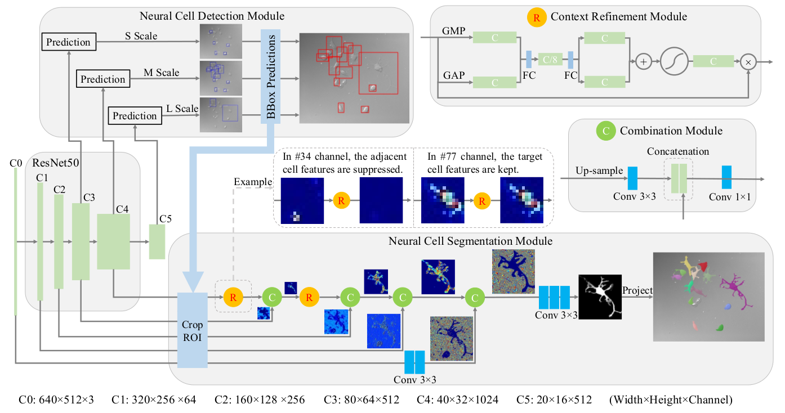

# CRNCIS-Pytorch
Context-refined neural cell instance segmentation,  [Paper Link](https://ieeexplore.ieee.org/abstract/document/8759204)

Please cite the article in your publications if it helps your research:

	@inproceedings{YI2019MICCAI,
		author = "Jingru Yi and Pengxiang Wu and Qiaoying Huang and Hui Qu and Daniel J. Hoeppner and Dimitris N. Metaxas"
		title = "Context-refined neural cell instance segmentation",
		booktitle = "ISBI",
		year = "2019",
	}
 
# Introduction
Neural cell instance segmentation serves as a valuable tool for the study of neural cell behaviors. In general, the instance segmentation methods compute the region of interest (ROI) through a detection module, where the segmentation is subsequently performed. To precisely segment the neural cells, especially their tiny and slender structures, existing work employs a u-net structure to preserve the low-level details and encode the high-level semantics. However, such method is insufficient for differentiating the adjacent cells when large parts of them are included in the same cropped ROI. To solve this problem, we propose a context-refined neural cell instance segmentation model that learns to suppress the background information. In particular, we employ a light-weight context refinement module to recalibrate the deep features and focus the model exclusively on the target cell within each cropped ROI. The proposed model is efficient and accurate, and experimental results demonstrate its superiority compared to the state-of-the-arts.

	

# Dependencies
Ubuntu 14.04, Python 3.6.4, PyTorch 0.4.1, Opencv-Python 3.4.1.15  

# Implementation Details
To accelerate the training process, we trained the detection and segmentation modules separately. In particular, the weights of the detection module are frozen when training the segmentation module.

